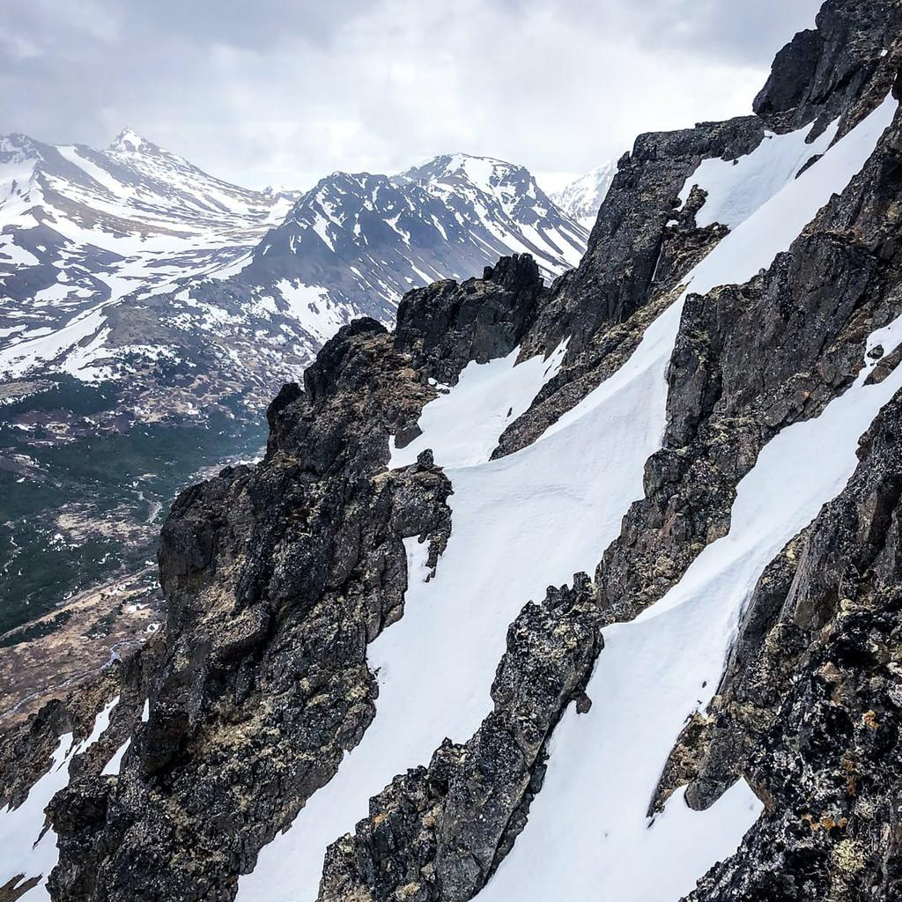
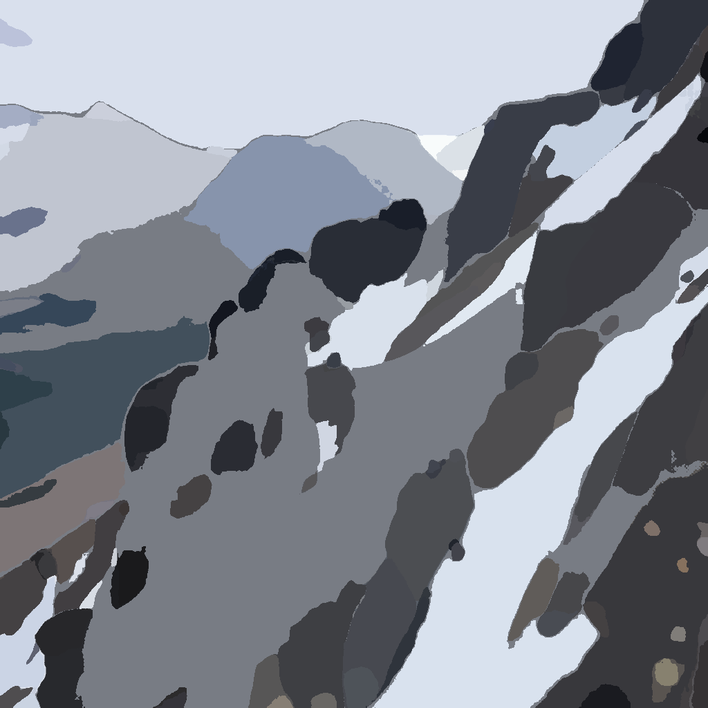
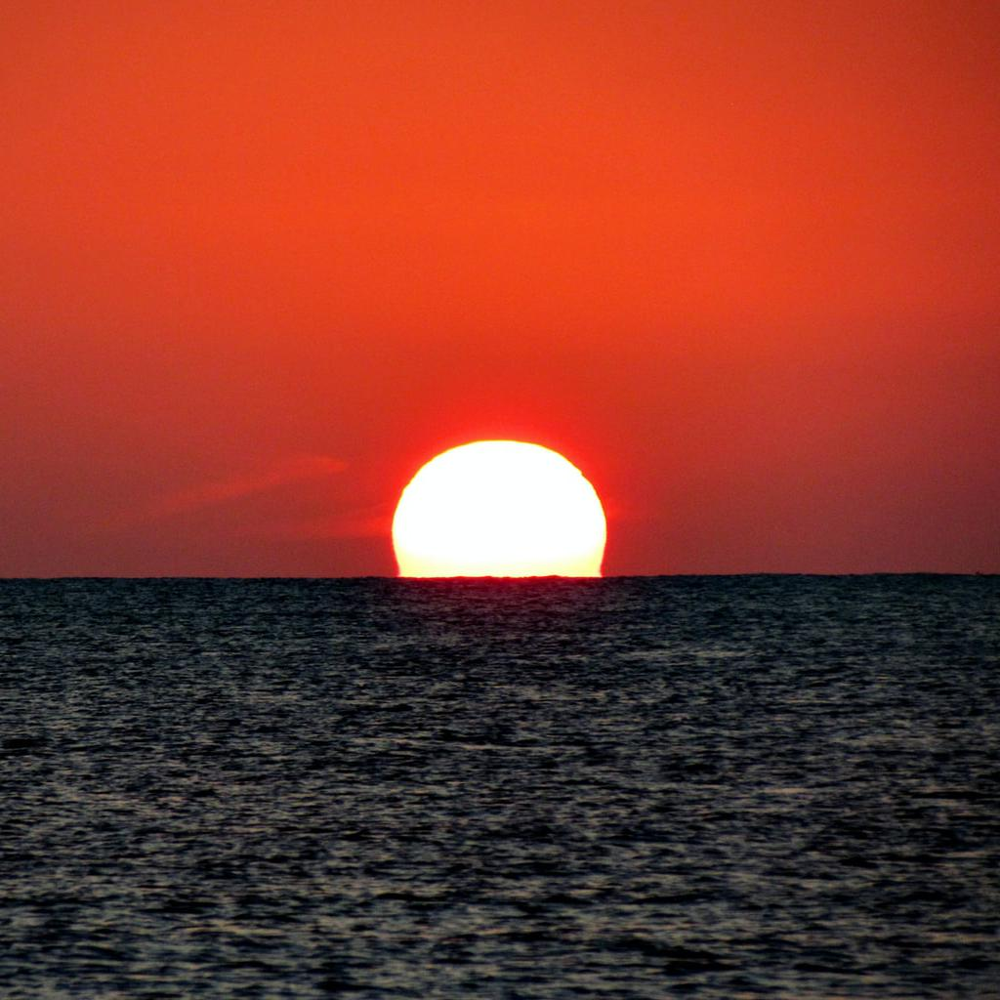
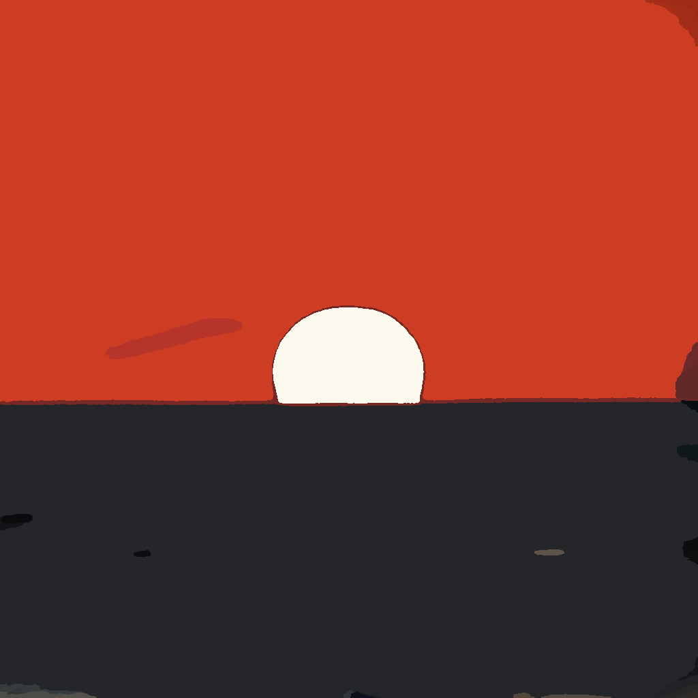

# 実写画像からセルアニメ調画像へのスタイル変換

実写の風景写真を、アニメーションの背景に使われるような**セル画調の画像**へ変換する研究・実験用プロジェクトです。

写真の細かな質感をそのまま残すのではなく、画像をいくつかの「面」へ分け、それぞれを単色で塗り、面の境界に輪郭線を加えます。これにより、手描きのセル画に近い、平面的で輪郭のはっきりした背景表現を目指します。

## まず何をしているものか

このプロジェクトは、次のような変換を自動で行います。

1. **写真を領域に分ける**  
   山、空、海、岩など、画像の中のまとまりを `SAM2`（Segment Anything Model 2）で自動検出します。
2. **領域ごとに一色で塗る**  
   各領域に含まれる画素の平均色を計算し、その領域全体を一つの色で塗りつぶします。
3. **境界に輪郭線を描く**  
   隣り合う領域の境界を検出し、黒い線として重ねます。
4. **PNG画像として保存する**  
   入力画像と同じ名前で、変換結果を出力フォルダに保存します。

つまり、画像生成AIに画風を「推測」させるのではなく、**領域分割・平均色・境界線というルールを組み合わせて、変換結果を制御しやすくしている**点が特徴です。

## 変換例

### 例1：雪山

| 入力：実写写真 | 出力：セルアニメ調 |
|:---:|:---:|
|  |  |
| 雪や岩、山の形を含む写真 | 面を単純化し、均一な色と輪郭線で表現 |

### 例2：夕日と海

| 入力：実写写真 | 出力：セルアニメ調 |
|:---:|:---:|
|  |  |
| 空、太陽、海の細かな明暗を含む写真 | 空・太陽・海を大きな色面として表現 |

出力画像では、写真に含まれる細かなグラデーションやテクスチャが減り、**大きな色のまとまりと明瞭な境界線**が目立つようになります。

## この研究の背景

アニメーションでは、キャラクターと背景の描画スタイルが大きく異なると、画面内に質感の違いが生じることがあります。特に、背景が動く「背景動画」では、背景もセル画のような表現にそろえることで、キャラクターとの一体感を高められる可能性があります。

一方、背景動画を人手で作るには、パースや構図を考えながら多くの絵を描く必要があり、時間と工数がかかります。このプロジェクトでは、実写画像を出発点にすることで、セル画調背景を作るための試行錯誤を効率化することを目指しています。

## 処理の考え方

```text
実写画像
   │
   ▼
SAM2で領域分割
   │  山・空・海・岩などの領域を検出
   ▼
領域ごとに平均色を計算
   │  各領域を一色で塗りつぶす
   ▼
領域の境界を検出
   │  境界に輪郭線を描く
   ▼
セルアニメ調の背景画像
```

### なぜこの方法を使うのか

一般的なスタイル変換手法は、画像全体をまとめて変換するため、次の点を細かく指定することが難しい場合があります。

- どの部分を一つの面として扱うか
- 面をどの色で塗るか
- 輪郭線をどこに、どの太さで描くか
- 同じ入力に対して同じ結果を得ること

このプロジェクトでは、画像の「構造を理解する処理」と「色・線を描く処理」を分けています。そのため、セル画調に必要な**ベタ塗り**と**輪郭線**を、ルールに基づいて明示的に生成できます。

## 実験結果の概要

同梱されている `sotuken/input100` と `sotuken/output100` には、100枚の入力画像と、それに対応する100枚の変換結果が収録されています。画像は1024×1024ピクセルです。

スライド・論文での評価では、次の傾向が確認されています。

- 大きな岩、建物、空、海など、形が明瞭な対象は、比較的大きな色の塊として表現しやすい
- 平均色を使うことで、領域内のグラデーションを抑えたベタ塗りを作れる
- 領域の境界から線を作るため、写真の明るさ変化に依存しない輪郭線を描ける
- 森林や鉄塔など、細かく複雑な構造では、領域が細かく分かれすぎたり、未検出領域が生じたりする
- 同じ領域に影とハイライトが含まれると、平均色がくすんで見えることがある
- 小さな領域が主要な領域の間に入ると、輪郭線が二重・多重に見える場合がある

そのため、本プロジェクトは完成された自動作画ツールというより、**実写からセル画調背景を作るための手法を検証する研究実装**として位置づけられます。

## ファイル構成

```text
2026B_AtsuhiroYoshii_Files/
├── README.md                         # この説明書
├── README.txt                        # 旧README（導入手順のメモ）
├── 2026B_AtsuhiroYoshii_Thesis.docx # 卒業論文
├── 2026B_AtsuhiroYoshii_Slides.pptx  # 発表スライド
└── sotuken/
    ├── input100/                     # 入力画像100枚（JPEG）
    ├── output100/                    # 変換結果100枚（PNG）
    ├── zikken1.py                    # 一括変換用Pythonスクリプト
    ├── zikken1.ipynb                 # 処理を確認しながら実行するJupyter Notebook
    └── requirements.txt              # Python依存パッケージ
```

### PythonスクリプトとNotebookの違い

- `zikken1.py`：複数の画像をまとめて変換するときに使います。
- `zikken1.ipynb`：処理の各段階を確認しながら、研究・検証を行うときに使います。

## 実行に必要なもの

主な実行環境は次のとおりです。

- Python 3.10以上
- PyTorch 2.5.1以上（CUDA対応GPUを推奨）
- torchvision 0.20.1以上
- SAM2本体と事前学習済みチェックポイント
- `sotuken/requirements.txt` に記載されたPythonパッケージ

GPUを使う場合は、利用するGPUに対応したCUDA環境が必要です。Windowsでは、既存の導入メモにあるとおり、WSL + Ubuntu環境の利用が想定されています。

## 基本的な導入手順

1. SAM2の公式リポジトリを取得します。

   ```bash
   git clone https://github.com/facebookresearch/segment-anything-2.git sam2
   cd sam2
   pip install -e .
   ```

2. SAM2のチェックポイントを取得します。

   ```bash
   cd checkpoints
   ./download_ckpts.sh
   cd ..
   ```

3. このフォルダの `sotuken` を `sam2` フォルダ内へ配置します。

4. 依存パッケージをインストールします。

   ```bash
   cd sotuken
   pip install -r requirements.txt
   ```

5. Notebookを使う場合は `zikken1.ipynb` を上から順に実行します。大量の画像を一括変換する場合は `zikken1.py` を使います。

> **注意:** スクリプト内の入力フォルダ名・出力フォルダ名やSAM2チェックポイントの場所は、実際の配置に合わせて確認してください。配布フォルダには研究成果の画像と実装が含まれますが、SAM2本体・チェックポイントは別途用意する必要があります。

## 今後の改善案

論文で挙げられている主な改善方向は次のとおりです。

- 小さすぎる領域を周囲の大きな領域へ自動的に統合する
- 平均値だけでなく、中央値や最頻値を使って影・ハイライトの影響を抑える
- 複数に分かれた境界線を一本化し、より自然な主線にする
- 構図の複雑さに応じて、領域分割の細かさを調整する

## 参考資料

詳しいアルゴリズム、実験条件、評価結果、今後の課題については、同梱の以下の資料を参照してください。

- `2026B_AtsuhiroYoshii_Thesis.docx`
- `2026B_AtsuhiroYoshii_Slides.pptx`

## クレジット・利用上の注意

本READMEの画像例は、このフォルダに収録されている入力画像・出力画像を使用しています。画像データセット、SAM2、論文・参考文献など、各素材の利用にあたっては、それぞれの配布元・ライセンス・引用条件を確認してください。
